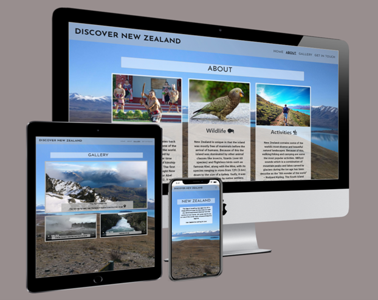

# **DISCOVER NEW ZEALAND** 
[Live Site Link](https://5-ean.github.io/discover-new-zealand/index.html)

>
> 
>
---
# INTRODUCTION
---
>
>This project sets out to engage with users on a multitude of devices and encourages them to discover New Zealand. Using UX principles to create a responsive and attractive website, that will increase exposer of the region. Ultimately leading to increased website traffic and an uptake in enquiries satisfying the business objective stated below.
>python3 -m http.server

## CONTENT:
> ## - [UX](#ux-deployment)
> ## - [FEATURES](#features)
> ## - [TECHNOLOGIES USED](#technologies-used)
> ## - [TESTING](#testing)
> ## - [DEPLOYMENT](#deployment)
> ## - [CREDITS](#credits)
---
# UX
---
### **STRATEGY, SCOPE & STRUCTURE**
**Business Objective:**
>The **business objective** is to increase interest in visiting New Zealand through the [*Discover New Zealand*](https://5-ean.github.io/discover-new-zealand/) webiste. The objective is focused on B2C (business to customer) sales, so it will be a more emotive driven experience. Using bold visuals and accessible language will ensure the project reaches the largest possible user base.

**Target User:** 
> * Users curious about New Zealand
> * Users of all age ranges (appropirate content)
> * English speakers & Users with English as second language (minimal wording/complexity to aid accessibility for all)
> * Users from all over the globe with varying internet connection speeds (website optimised to reduce loading times where possible)
> * Users of all platforms (mobile first design)

**User Stories:**
> 1. "As a user who has never been to New Zealand, is the site going to provide relevant information? Will it be easy to understand? Can I see topics that interest me quickly…..or will I have to read pages of information to find out? I don’t want to spend a long time on the site, but I want my experience to be rewarding."
>
> 2. "As a mobile dependent user of this website, I want to have a polished and engaging experience on the website even though I do not have access to a desktop/laptop."
>
> 3. "As a visual user of the website, I want high quality media displayed on the site for my viewing pleasure. I find images & videos more appealing than lots of text."
>
> 4. "As an interested user of the website, I want to send questions if I require more information….is their reciprocation? Can you send me additional information at my request? This will provide me with the extra details to make an informed decision about visiting New Zealand."
>
> 5. "As a less technical user I want an easy to navigate website, over-complicated designs will put me off exploring the site. Which will keep me for recommending and returning to the website in the future."  

**Addressing User Stories & Business Objective**  
> * Home page: basic requirement for all sites, will “sell” experience to user and provide eye catching hero image (addressing business objective).
> * About page: addressing user story 1.
> * Gallery page: addressing user story 3.
> * Get In Touch page: addressing user stories 4.
> * Use of Bootstrap: addressing user stories 2 & 5.

**Project Content** 
>Within [Balsamiq](https://balsamiq.com/) a [table](https://github.com/5-ean/discover-new-zealand/blob/563bcd72d188b530b0f83b66682e1105c0e8078d/assets/ux_assets/images/content-table.pdf) of possible content was created to populate the project. A **wireframe site map** was then created to structure the content and project as a whole.
>
> The [Wireframe](https://github.com/5-ean/discover-new-zealand/blob/7f9d3df776b7bd97d4fdb0b2986230bd2601a7bd/assets/ux_assets/images/sitemap-wireframe.pdf) site map is a rough guide. Some content has been removed, specifically *(content)FAQ's*, *(content)videos* and *(content)links through to booking* because it lacks importance or is not viable at this time. 
 
### **SKELETON & SURFACE**

>The remaining features and content kept in make up the **minimal viable product** at this time. The **MVP** *(minimal viable product)* consists of the [Home](https://github.com/5-ean/discover-new-zealand/blob/7f9d3df776b7bd97d4fdb0b2986230bd2601a7bd/assets/ux_assets/images/index.html-wireframe.pdf) page, [About](https://github.com/5-ean/discover-new-zealand/blob/7f9d3df776b7bd97d4fdb0b2986230bd2601a7bd/assets/ux_assets/images/about.html-wireframe.pdf), [Gallery](https://github.com/5-ean/discover-new-zealand/blob/7f9d3df776b7bd97d4fdb0b2986230bd2601a7bd/assets/ux_assets/images/gallery.html-wireframe.pdf) & [Get In Touch](https://github.com/5-ean/discover-new-zealand/blob/7f9d3df776b7bd97d4fdb0b2986230bd2601a7bd/assets/ux_assets/images/get-in-touch.html-wireframe.pdf) pages respectively.

**Colour Scheme & Background**
> The pictures used for the project were of natural landscapes with high ratios of green, blue, white, and brown colouring. Therefore, the stylistic choice was to use off white/grey colouring with opacity for the footer element. The Header was a solid grey colour to block content scrolling under as the user move the page up. The colour scheme along with subtle, thin borders around content elements gave a natural feel to the site overall.
>
>   *Navigation background colour*
> * Hex  (#cfcccc)
>
>  *Footer background colours:*
> * rgba(185, 185, 185, 0.5)
>  
>  *Content background colour:*
> * rgba(255, 255, 255, 0.5 - 0.7)

**Buttons & Links**

>To aid usability links and buttons followed the same style. Notably changing from black to white when hovered over. This is a sharp contrast and a nod to New Zealand Sports and Culture as white and black have long been the colour scheme for the country in many regards.

---
# FEATURES
---
>**Home Page / Navigation & Footer Elements -**
> * Simple, easy to understand layout with user feedback on all links both internal and external.
> * Bootstrap based navigation header, with collapse function in mobile view.
> * Social links in footer element, along with copywrite information.
> * Short introduction text to info user of the goal of the site.
>
>
**About Page / Information Content -** 
> * A section containing  condensed information about New Zealand.  
> * Links within the section that will take user to the source material.
>
>
>**Gallery Page / Google Maps Location Links -**
> * Multiple images of New Zealand.
> * Additional information provided on pictures from captions underneath. 
> 
>
>**Get In Touch Page / User Form submission -**
> * Concise form with active feedback for the user.
> * Allows them interaction between the Site operators and the users of said website.
>
>

## **Existing Feature**
> * **Header Navigation :**  Allows the user to navigate through the sites four pages.
> * **Footer Section :** 
> 1. Contact Us - A link to a pop up modal that contains the form for getting in touch. 
> 2. Copywrite -  A small static element displaying the site creator and year of implementation.
> 3. Social Media - Multiple links throught to big social media site.
>* **About page :** Bootstrap cards with relevant images, information and links through to Wikipedia source material.
> * **Gallery page :** Contains pictures and videos of New Zealand. With accompanying text describing location (on large and medium devices)
> * **Get In Touch page :** A form set up to give the site operator more information about the users of the site to help with targeting. And a way for the users to give feedback, express ideas and enquiry about the site/ content presented on it. 
---
# TECHNOLOGIES USED
---
> * [HTML5](https://html.com/html5/) : The markup language used for structuring and presenting content on the Discover New Zealand website.
> * [CSS3](https://html.com/css/) : The language that defines the presentation of a website Discover New Zealand.
> * [BOOTSTRAP V4.6](https://getbootstrap.com/docs/4.6/getting-started/introduction/) : Used in the project to create a mobile-first designed website. It is the most popular front-end open source toolkit.
> * [FONT AWESOME](https://fontawesome.com/) : Used in the project to provide vector icons and social media logos.
> * [GOOGLE FONTS](https://fonts.google.com/) : Provided typography to the project. It is a robust collection of open source designer web fonts.
> * [TINY PNG](https://tinypng.com/) : Used to reduce the file size of PNG files in the project.
> * [BALSAMIQ](https://balsamiq.com/) : Used to create a table and multiple wireframes for the project. Licence provided by [Code Institute](https://codeinstitute.net/).
> * [GITPOD](https://www.gitpod.io/) : The interaction development environment (IDE) used to write the projects code.
> * [GITHUB](https://github.com/) : Provides hosting for software development version control using Git. The host of this project.
> * [GIT](https://git-scm.com/) : Git is a free and open source distributed version control system.
---
# TESTING
---
**Displey and Browser Testing**
> * **Moblie View:** On small screen sizes(mobile) the content for each page is centralise. The header nav links collapses into a right-handed dropdown menu when interacted with. The footer only displays the social links and contact us modal link.
>
> * The about page which was three columns on large screen sizes now switches to display the content vertically. 
>
> * On the gallery page in small size sizes the captions underneath the bootstrap carousel images are hidden, along with in caption information accompanying the videos. 

    
**Validating User Stories**
> **Story 1 - ("Will it be easy to understand? Can I see topics that interest me quickly....") :** 
>The bulk of the site information is found on one html page (about), It is a summary of three general topic that should interest most users. If they require more information the button “Learn More” will open a new tab to the Wikipedia article the specific topic is referencing.

>**Story 2 - (As a mobile dependent user of this website, I want to have a polished and engaging experience...") :**
>The website has been tested on all mobile screen sizes within html inspector. It is responsive due to the use of bootstrap. All site functions/links were tested on a OnePlus 3T mobile device and worked as expected.

> **Story 3 - ("As a visual user of the website, I want high quality media displayed on the site for my viewing pleasure...") :**
>The gallery page contains high quality images and videos of New Zealand with accompanying information on larger device sizes, on small mobile devices the page just contains images and video and minimal text. 

>**Story 4 - ("...I want to send questions if I require more information….is their reciprocation? Can you send me additional information at my request?") :**
>Users can complete a form found in the footer (contact us link) or in the ‘get in touch page’. It contains space to send a question, along with other basic information fields. The form needs to be completed in full in order for the Form Submitted message to appear. 

>**Story 5 - ("As a less technical user I want an easy to navigate website, over-complicated designs will put me off...") :**
> The site follows clear and logical progression, with links and interactive elements all sharing similar stylings. The content is laid out with a western target audience in mind (reading left to right) and this is reflected in the information layout of the nav header, footer and main pages of the website. With Most important on the left to least important on the right. All feature and link are accessible within three mouse clicks of entering the site.
### Links :
> * All social links tested and open in seperate windows.
> * All internal navigation links tested and lead to described locations within same browser window.
> * All pindrop google map links (gallery.html- carousel caption area) tested, open in new window and correspond to image displayed on website.

### Form :
> * Can not submit form without all inputs fields being filled in. Valid and invalid feedback helps users achieve goal.
> * Must enter valid email into form.
> * If all input fields are filled and valid the form will run a modal pop up with the message *Form submited*

[**W3C Validator :**](https://validator.w3.org/)

> * **Index.html -** 

> * **about.html -** 

> * **gallery.html -**  

> * **get-in-touch.html -** 

[**CSS Validator :**](https://jigsaw.w3.org/css-validator/)

> * **style.css -** 

[**Google Lighthouse :**](https://developers.google.com/web/tools/lighthouse/) (Can be launched viva the inspect browser window, far right of the top tab within the dropdown menu)
>Home Page - 
> * [Mobile Test](docs/images/lighthouse-images/index-mobile.pdf)
> * [Desktop Test](docs/images/lighthouse-images/index-desktop.pdf)
>
>About Page - 
> * [Mobile Test](docs/images/lighthouse-images/about-mobile.pdf)
> * [Desktop Test](docs/images/lighthouse-images/about-desktop.pdf)
>
>Gallery Page - 
> * [Mobile Test](docs/images/lighthouse-images/gallery-mobile.pdf)
> * [Desktop Test](docs/images/lighthouse-images/gallery-desktop.pdf)
> * Notes - Images used for the bootstrap carousel are large in size (even after compression) on mobile device, resulting in a drop in performance rating.
>
>Get In Touch Page - 
> * [Mobile Test](docs/images/lighthouse-images/get-in-touch-mobile.pdf)
> * [Desktop Test](docs/images/lighthouse-images/get-in-touch-desktop.pdf)

**Bugs & Fixes**

>General - 
> * Text sizing issue within nav and footer sections. Had to use media queries based on veiwport width to adjust at different breakpoints. This resized the text so it wasn't so large on smaller devices.
> * I could not give my hero-image class (Website background) an alt attribute. Still not resolved, this will have to be a future fix. It affects accessibility on all pages.
> * Container-fluid class margin L + R auto causes issues in md, lg and larger screen sizes. The width is not being used effectively. Not fixed at this time, but site is still viewable on all devices.

>About Page: Learn More Button - 
> * Originally an < a > link nested inside a button element, this is invalid by w3c standards. Link leads to relevant wikipedia source page. Fixed using solution from stack overflow. Onclick="window.open(...) allowed me to remove < a > element and keep button element inplace.

>Get In Touch Page: Form - 
> * On page opening invalid feedback is present, ideally the form would be neutral until interacted with by the user. No Fixed at this time, due to complexity and lack of understanding on my part, will be revisited. 
---
# DEPLOYMENT
---
**How Do I Create A Project :**
> 1. Sign on to github/create a new account.
> 2. Select New Repository.
> 3. Name the repository and click the green button.
> 4. You will be taken to gidpod where you can start coding.

**How I Deploy The Project To GitHub :**
> 1. Log on to [GitHub](https://github.com/), clicked the repository named [discover-new-zealand](https://github.com/5-ean/discover-new-zealand).
> 2. Select the settings tab and scroll to the section headed GitHub Pages.
> 3. In the sub-heading of Source, select the master branch and then save.
> 4. The site is now deployed and a live [link](https://5-ean.github.io/discover-new-zealand/) is given.

**How Do I Fork The Repository :**
> 1. Go to the discover-new-zealand repository.
> 2. Click Fork button in the very top right corner of the browser.
> 3. This creates a copy.
> 4. You can now click pull request and within the dropdown select New Pull Request.

**How To Deploy Locally :**
> 1. Log on to [GitHub](https://github.com/), clicked the repository named [discover-new-zealand](https://github.com/5-ean/discover-new-zealand).
> 2. Select the dropdown tab "Code" and choose Download ZIP.
> 3. Un-zip files and it's ready to use on your local environment.
---
# CREDITS
---
**Hints/Tips/Documentation**
> * [W3School](https://www.w3schools.com/) - For general HTML 5 & CSS 3 help.
> * [Stack Overflow](https://stackoverflow.com/) - Used for specific problems and fixes.
> * [Bootstrap Documentation](https://getbootstrap.com/docs/5.0/getting-started/introduction/) - Informing layout and content of website. Instrumental in execution of project.
> * [Google](https://www.google.com/) - When in doubt...

**References**
> * [Code Institute](https://codeinstitute.net/) - Project inspired by Rosie (resume-project) & Whiskey Drop project.
> * [Wikipedia](https://www.wikipedia.org/) - Pages used as links in 'about.html' learn more buttons.
> 1. History link and section - https://en.wikipedia.org/wiki/History_of_New_Zealand
> 2. Wildlife link and section - https://en.wikipedia.org/wiki/Biodiversity_of_New_Zealand
> 3. Activites link and section - https://en.wikipedia.org/wiki/Tourism_in_New_Zealand
> * [Google maps](https://www.google.co.uk/maps) - Used for pindrop link in bootstrap carousel caption area.
> * **Text & Images** - Text generation by myself and [Wikipedia](https://www.wikipedia.org/). Background images and gallery elements for the Project were taken by myself.
> * [Pixabay](https://pixabay.com/) - Images from site used for about pages card pictures.
> 1. Card 1 Maori image - Picture uploaded by Barni1.
> 2. Card 2 Kea image - Picture uploaded by Barni1.
> 3. Card 3 Tekapo image - Picture uploaded by bougetonglobe.

**Special Mentions**
> * Code Institute/Slack community  - for the support and motivation
> * Rohit Sharma - For the support, motivation and excellent feedback. 

